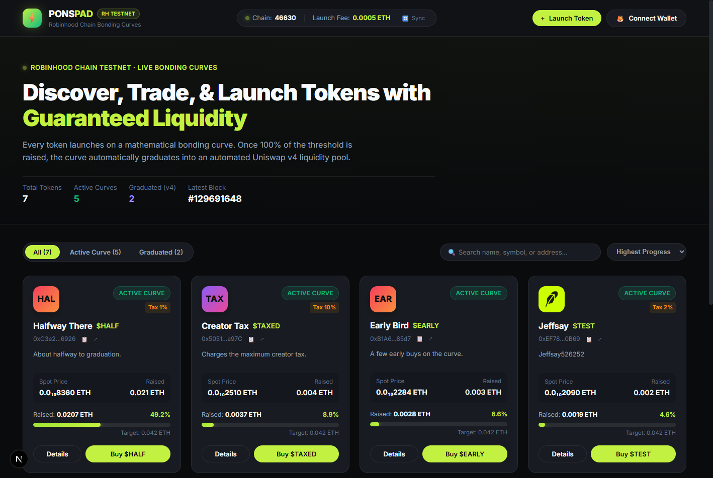
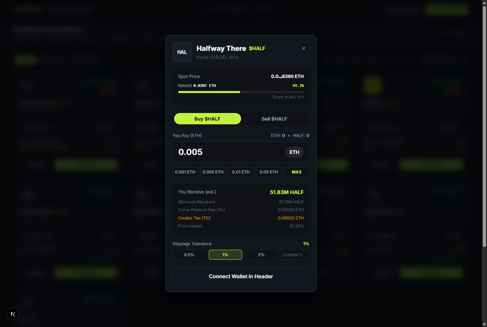
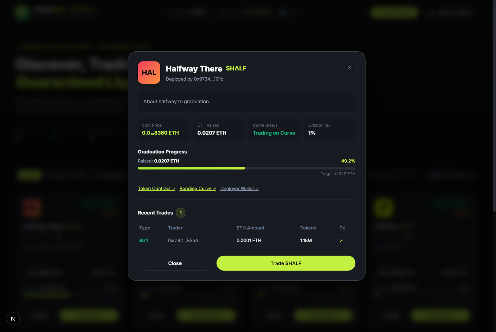
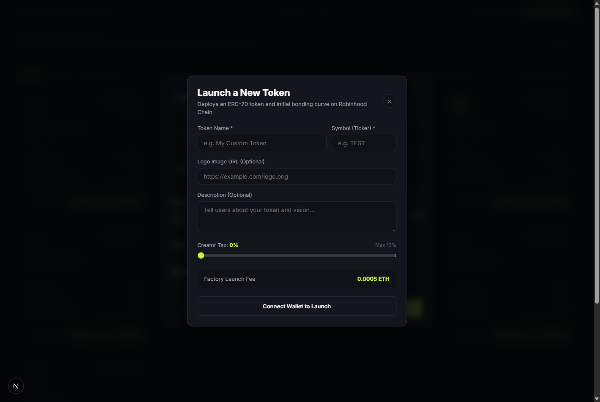

# Robinhood Chain Token Launchpad

Frontend Web3 Launchpad terdesentralisasi untuk memperdagangkan dan meluncurkan token melalui **Bonding Curve** di **Robinhood Chain Testnet**, dengan integrasi kelulusan otomatis (*graduation*) ke pool liquidity Uniswap v4.

Aplikasi ini dibangun mengacu pada standar visual dan UX modern dari [ponsfamily.com/launchpad](https://ponsfamily.com/launchpad).

---

## Bukti Visual (Screenshots)

Semua bukti visual tersimpan di folder [`/screenshots`](./screenshots) dan [`/launchpad/public/screenshots`](./launchpad/public/screenshots):

| Tampilan | Screenshot | Deskripsi |
|---|---|---|
| **Daftar Token & Header** |  | Menampilkan header status (Chain ID `46630`, Launch Fee `0.0005 ETH`), filter tab, search bar, dan kartu token lengkap dengan progress bar. |
| **Form Beli (Bonding Curve)** |  | Form beli dengan perhitungan kurva real-time (BigInt), estimasi token keluar, fee 1%, creator tax, toleransi slippage, dan status validasi. |
| **Detail Token & Riwayat Trade** |  | Menampilkan deskripsi token, tautan kontrak (Token, Curve, Deployer) di Robinhood Explorer, dan riwayat transaksi trade. |
| **Launch Token Baru (Bonus)** |  | Modal pembuatan token baru dengan preview economics, generasi salt acak 32-byte, creator tax slider, dan validasi launch fee. |

---

## Cara Menjalankan Project

### 1. Prasyarat
- **Node.js** >= 18.17 (Direkomendasikan Node.js v20 atau v22)
- **npm** atau **pnpm**
- Browser Chromium (Google Chrome / Brave / Edge) dengan ekstensi **MetaMask**

### 2. Instalasi & Menjalankan Aplikasi
```bash
# Masuk ke direktori frontend
cd launchpad

# Install dependensi (Next.js 16, React 19, viem v2, wagmi v3, react-query)
npm install

# Jalankan server development
npm run dev
```

Buka browser Anda dan akses:
```
http://localhost:3000
```

### 3. Build Production (Opsional untuk Verifikasi)
```bash
cd launchpad
npm run build
npm run start
```

---

## Konfigurasi Jaringan (Robinhood Chain Testnet)

Aplikasi telah dilengkapi tombol **"Switch to Robinhood Testnet"** otomatis di banner dan header jika wallet Anda berada di network lain (`wallet_addEthereumChain` / `wallet_switchEthereumChain`).

Jika ingin menambahkan secara manual di MetaMask:
- **Network Name:** Robinhood Chain Testnet
- **Chain ID:** `46630` (Hex: `0xb626`)
- **Currency Symbol:** `ETH` (18 decimals)
- **RPC URL:** `https://robinhood-sepolia-rpc.publicnode.com`
- **Block Explorer URL:** `https://explorer.testnet.chain.robinhood.com`
- **Faucet:** `https://faucet.testnet.chain.robinhood.com/`

---

## Keputusan Teknis Penting & Alasannya

### 1. Framework & Web3 Core
- **Next.js 16 (App Router + Turbopack) & React 19:** Memberikan performa render tercepat dan bundling modern.
- **Viem v2 & Wagmi v3:** Pemilihan Viem karena ukurannya yang ringan, tipe ABI yang kuat (*type-safe*), dan performa Multicall3 tercepat dibandingkan ethers.js.

### 2. Desain & Styling (Vanilla CSS)
- Menggunakan arsitektur CSS kustom murni (`globals.css`) dengan sistem token CSS variables (`--bg-card`, `--accent-lime`, `--border-subtle`, dll.).
- Mengadopsi palet warna gelap modern ponsfamily dengan aksen *high-contrast lime green* (`#c2f141`) untuk tombol aksi utama (*CTA*), badge aktif, dan indikator progres.
- Tidak menggunakan framework CSS berat pihak ketiga agar kontrol visual penuh dan performa halaman maksimal.

### 3. Penanganan Batas RPC `eth_getLogs` (50.000 Blok)
- RPC publik Robinhood Testnet membatasi panggilan log maksimal 50.000 blok. Factory dideploy di blok `129157568`, sedangkan blok saat ini sudah mencapai >`129690000` (rentang >530.000 blok).
- Solusi di hook `useTokenIndexer`:
  1. Melakukan pemindaian bertahap dalam potongan (*chunks*) sebesar 49.000 blok.
  2. Mengimplementasikan caching di sisi client (`localStorage`) untuk menyimpan token yang sudah terindeks dan blok terakhir yang discan (`lastScannedBlock`).
  3. Saat halaman dibuka kembali atau di-refresh, aplikasi hanya perlu menscan blok-blok baru dari `lastScannedBlock + 1` hingga blok terbaru. Ini membuat pemuatan halaman instan tanpa query berulang ratusan ribu blok.
  4. Polling otomatis berkala setiap 20 detik untuk mendeteksi token baru yang di-launch di blockchain.

### 4. Multicall3 Batching untuk Data Pasar Token
- Membaca 10 parameter per token (`name`, `symbol`, `logo`, `description`, `getReserves`, `realQuoteReserve`, `graduationThreshold`, `feeBps`, `creatorTaxBps`, `getLaunchedToken`).
- Alih-alih membuat puluhan HTTP request terpisah, hook `useTokensWithData` menggabungkan seluruh pemanggilan kontrak untuk seluruh token ke dalam **satu panggilan Multicall3** (`0xcA11bde05977b3631167028862bE2a173976CA11`) dengan `allowFailure: true`.

### 5. Ketepatan Perhitungan Bonding Curve (Strict BigInt)
- Seluruh perhitungan bonding curve di `utils/curve.ts` dilakukan murni menggunakan tipe data primitif `BigInt` dengan basis poin (`10000n`):
  ```typescript
  fee        = quoteIn * feeBps / 10000n;
  creatorTax = quoteIn * creatorTaxBps / 10000n;
  net        = quoteIn - fee - creatorTax;
  tokensOut  = net * tokenReserve / (quoteReserve + net);
  minTokensOut = tokensOut * (10000n - slippageBps) / 10000n;
  ```
- Nilai wei tidak pernah diubah menjadi tipe JavaScript `Number` sebelum kalkulasi matematika selesai, mencegah kehilangan presisi pada angka 18 desimal.
- Input divalidasi ketat dengan `parseEther`, menolak format angka tidak valid atau desimal melebihi 18 digit.

### 6. Format Harga Spot Ramah Pengguna
- Harga token di bonding curve sangat kecil (contoh: `0.00000000836 ETH`).
- Fungsi `formatSmallPrice` memformat angka ini secara elegan menggunakan Unicode subscript untuk jumlah angka nol di depan (misal: `0.0₁₀8360 ETH`), sehingga tidak pernah menampilkan nilai misleading seperti `0.00 ETH`.

### 7. Penanganan Transaksi & Error Revert
- Form beli dan jual menangani 5 status transaksi:
  1. *Waiting confirmation*: Tombol dinonaktifkan dengan teks "Confirm in MetaMask...".
  2. *Submitted/Pending*: Indikator berdenyut dengan tautan langsung ke transaksi di Robinhood Explorer.
  3. *Success*: Menampilkan jumlah token aktual yang diterima dari parsing event `CurveBuy` pada receipt transaksi.
  4. *Rejected*: Deteksi error kode 4001 / rejection pengguna, form tetap dapat langsung digunakan kembali.
  5. *Reverted*: Menerjemahkan error kontrak secara spesifik:
     - `SlippageExceeded` (`0x808b26f5`): Disajikan sebagai pesan panduan untuk menaikkan toleransi slippage.
     - `CurveGraduated` (`0x34460a80`): Informasi bahwa token telah selesai diperdagangkan di curve dan pindah ke Uniswap v4.

---

## Fitur Lengkap yang Telah Diselesaikan

### Fitur Utama (Langkah 1–9)
- [x] **Langkah 1 — Setup Project & Network:** Integrasi Next.js, Viem, Wagmi, dan membaca fungsi `launchFee()` (0.0005 ETH) dari LaunchFactory.
- [x] **Langkah 2 — Connect Wallet:** Connect/Disconnect, deteksi alamat wallet, saldo ETH, dan deteksi/perpindahan network otomatis ke Robinhood Testnet.
- [x] **Langkah 3 — Ambil Daftar Token:** Indexing bertahap (chunked 49k blok) dari deploy block factory `129157568` hingga blok terbaru. Mendapatkan seluruh 5 token contoh (`FRESH`, `EARLY`, `HALF`, `TAXED`, `GRAD`) plus token baru.
- [x] **Langkah 4 — Lengkapi Data Tiap Token:** Multicall3 untuk nama, simbol, logo, deskripsi, cadangan curve, real quote reserve, target kelulusan, dan status phase (`0`, `1`, `2`, `3`).
- [x] **Langkah 5 — Tampilkan Daftar Token:** Desain kartu ponsfamily dengan status badge, logo placeholder dinamis (generatif gradien), harga spot ber-subscript, bar progres kelulusan, serta tampilan loading skeleton, empty state, dan error state dengan tombol coba lagi.
- [x] **Langkah 6 — Form Beli Token:** Perhitungan output token matematis, fee protokol, creator tax, price impact, dan pilihan slippage (0.5%, 1%, 2%, custom). Validasi saldo ETH dan status phase.
- [x] **Langkah 7 — Kirim Transaksi Beli:** Eksekusi transaksi `buy(quoteIn, minTokensOut, recipient)` dengan 5 state lengkap dan tautan explorer.
- [x] **Langkah 8 — Pembaruan Data Real-time:** Refresh saldo ETH, saldo token, cadangan curve, dan harga tanpa reload halaman.
- [x] **Langkah 9 — README & Bukti Visual:** Dokumentasi lengkap dan tangkapan layar di `/screenshots`.

### Fitur Bonus Tambahan
- [x] **Bonus Utama — Launch Token Baru:** Form peluncuran token dengan preview economics (`previewLaunchEconomics`), pembuatan 32-byte salt acak kriptografis, slider creator tax (0-10%), dan pembayaran tepat `launchFee()`.
- [x] **Bonus — Sell Token:** Mode jual token kembali ke bonding curve dengan alur approval ERC-20 otomatis (`approve` -> `sell`).
- [x] **Bonus — Detail Token & Riwayat Trade:** Modal detail dengan informasi deployer, tautan explorer, serta stream riwayat transaksi terkini dari log event `CurveBuy` dan `CurveSell`.
- [x] **Bonus — Pencarian & Penyortiran:** Pencarian instan berdasarkan nama, simbol, dan alamat kontrak, serta pengurutan berdasarkan progres tertinggi, token terbaru, dan dana terkumpul.

---

## Apa yang Belum Selesai / Potensi Pengembangan Lanjutan

1. **Grafik Candlestick Interaktif (TradingView):**
   - Saat ini riwayat perdagangan diambil langsung dari event log RPC. Untuk menampilkan grafik candlestick multi-timeframe (1m, 5m, 1h) secara akurat diperlukan subgrapah pengindeksan data historis (misal: Subgraph The Graph / Goldsky) untuk agregasi OHLCV.
2. **Interface Swap Uniswap v4 untuk Token Graduated:**
   - Untuk token yang telah mencapai Phase 2 (`GRAD`), transaksi curve dinonaktifkan. Pengembangan berikutnya adalah menghubungkan form swap langsung ke router pool Uniswap v4 testnet.

---

## Bagian yang Dibantu AI

- **Boilerplate Konfigurasi:** Inisialisasi struktur Next.js 16 dan Wagmi v3 provider.
- **Sistem Desain Visual:** Inspirasi palet warna dan struktur CSS untuk menyerupai nuansa ponsfamily.com.
- **Automasi Tangkapan Layar:** Skrip Python pengontrol Chrome DevTools Protocol (CDP) untuk menangkap tangkapan layar otomatis seluruh modal aplikasi.

---

## Catatan & Temuan Teknis pada Kontrak

1. **Batas Rentang Blok RPC:**
   - RPC publik Sepolia Robinhood Testnet membatasi maksimal 50.000 blok per panggilan `eth_getLogs`. Implementasi chunked indexing sebesar 49.000 blok berhasil mengatasi kendala ini sepenuhnya.
2. **Pemberlakuan `canLaunch(address)`:**
   - Kontrak `LaunchFactory` memiliki fungsi pemeriksa `canLaunch(address)`. Jika address wallet belum diotorisasi oleh admin factory, transaksi launch token akan dicegah dengan notifikasi yang jelas kepada pengguna.
3. **Status Phase 2 (Graduated):**
   - Token contoh `GRAD` berada di Phase 2. Tombol beli berhasil dinonaktifkan secara otomatis dan diberi label "Graduated" sesuai instruksi brief.

---

**Dibuat untuk:** Tes Masuk Web3 Developer (Fullstack)  
**Host Repositori:** GitHub ([kodomo-toothpaste](https://github.com/kodomo-toothpaste))
